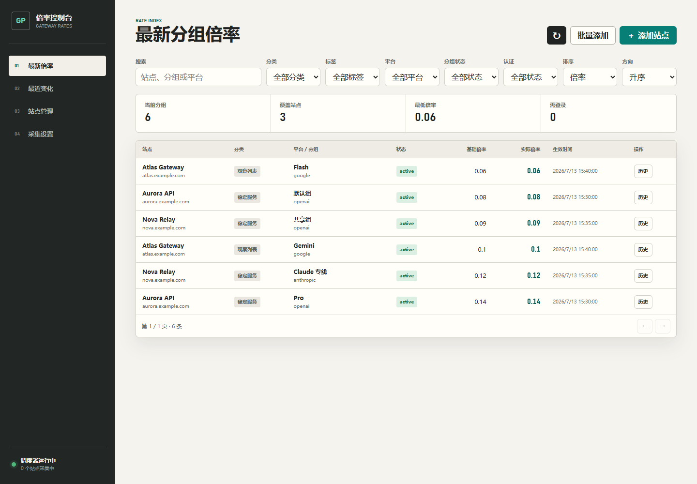

# 分组倍率控制台


[English](README.md) | [简体中文](README.zh-CN.md)

一个可自托管在 Windows 或 Linux 的分组倍率控制台，用于采集、比较并通过 API 提供 sub2api、NewAPI 及兼容网关的价格数据。

## 为什么做

中转站价格通常散落在需要登录的后台里，接口格式还各不相同。本项目把采集、排序、历史、认证状态和外部软件集成收进一个本地工具，并避免把凭据放进项目目录。

## 核心特性

- 采集 sub2api 风格接口和 NewAPI 的分组倍率。
- 可见的 Uling19 Provider 已删除，仅保留 sub2api 和 NewAPI。SQLite v4 会自动把旧 `uling-gateway` 站点迁移为 `sub2api`，不改变 URL、站点记录或倍率历史。
- 支持 sub2api 邮箱密码和可移植 Token、NewAPI 公开/Token 增强采集，以及持久化 Edge Profile 兜底。
- 使用 Windows DPAPI 或 Linux 服务端 AES-256-GCM Vault 加密保存账号凭据，SQLite 只保存元数据。
- 按站点、分类、标签、平台、分组状态和认证状态筛选排序。
- 支持每站点倍率换算系数和本地隐藏分组，不重写已采集历史。
- 显式记录分组新增删除、倍率、说明、RPM、额度、计费和峰值规则变化。
- 分层定时采集、并发上限控制和单站失败隔离。
- 通过 `/api/external/v1` 为本机或局域网其他软件提供稳定只读接口。
- 支持普通 JSON/CSV 数据导出，以及使用密码加密、可移植的 `.gpfbackup` 完整灾备。
- 使用加密 `.gpftransfer` 在相互独立的实例间交换站点配置和账号凭据。

## 截图与演示



控制台默认运行在 `http://127.0.0.1:5177`，也可以放在带认证的 HTTPS 反向代理后面。

## 快速开始

### 环境要求

- Windows 10/11 或当前仍受支持的 Linux 发行版
- Node.js 22.5 或更高版本
- Windows 使用浏览器 Profile 认证时需要 Microsoft Edge

```powershell
npm install
npm start
```

打开 [http://127.0.0.1:5177](http://127.0.0.1:5177)，添加站点并选择 Provider 和认证方式，然后执行第一次手动刷新。

注册当前 Windows 用户登录后的自动任务：

```powershell
npm run startup:install
```

使用 `npm run startup:uninstall` 删除自动任务。

Linux 需要把随机 32 字节十六进制 Vault Key 持久化到仅 root 可读的环境文件，并把数据目录放在仓库外：

```bash
export GROUP_PRICE_FETCHER_HOME=/var/lib/group-price-fetcher
export GROUP_PRICE_FETCHER_VAULT_KEY="$(openssl rand -hex 32)"
npm install
npm start
```

每次重启必须使用同一 Vault Key；密钥丢失或更换后，已有凭据库无法解密。Linux 支持公开接口、NewAPI Token、sub2api 邮箱密码和可移植 sub2api Token 认证；Edge Profile 认证和登录态提取仍仅支持 Windows。公网部署时应让 Node 继续监听 `127.0.0.1`，并在反向代理层强制 HTTPS 和登录认证。

### 可移植 sub2api Token 流程

在 Windows 上，先让现有 sub2api 站点通过专用 Edge Profile 完成登录，然后编辑该站点并点击“提取 Edge 登录态”。Access Token 和可选的 Refresh Token 只会填入敏感输入框一次；保存站点后才会切换为 `sub2api-token`。在 Linux 上可以编辑站点并直接粘贴这两个字段，也可以导入 Windows 生成的加密 `.gpftransfer`。

采集器会复用仍有效的 Access Token。Access Token 过期且存在 Refresh Token 时，会自动刷新并把轮换后的 Token 写回加密凭据库；没有 Refresh Token 或刷新失败时，站点会变为 `login_required`，需要在 Windows 重新提取或手动更新。普通状态、站点、导出和采集 API 都不会返回原始 Token。

## 外部 API

本机回环请求不要求 API Key：

```powershell
Invoke-RestMethod http://127.0.0.1:5177/api/external/v1/sites
Invoke-RestMethod http://127.0.0.1:5177/api/external/v1/rates
Invoke-RestMethod http://127.0.0.1:5177/api/external/v1/changes
```

稳定的版本化资源：

```text
GET /api/external/v1/sites
GET /api/external/v1/rates
GET /api/external/v1/changes
GET /api/external/v1/sites/:id/rates
GET /api/external/v1/sites/:id/changes
GET /api/external/v1/sites/:id/groups/:groupId/history
```

局域网访问需要在设置中生成 API Key，以 `HOST=0.0.0.0` 启动，并发送 `Authorization: Bearer <API_KEY>`。管理和凭据接口仍只允许本机访问。

## 导出、备份与恢复

设置页提供三类用途不同的导出：

- 普通 JSON/CSV 仅包含公开站点数据、当前倍率和变化数据，不包含登录凭据或 API Key 哈希，不适合完整灾备。JSON 包含公开站点、当前倍率和变化集合；CSV 包含当前倍率记录。
- `.gpfbackup` 是完整可移植备份，包含已执行 checkpoint 的 SQLite 数据库和已保存凭据，使用 scrypt（`N=32768`、`r=8`、`p=1`）派生密钥并以 AES-256-GCM 加密。Edge Profile 和浏览器 Cookie 不包含在内。
- `.gpftransfer` 只包含可移植的站点配置和账号凭据，包括可移植的 sub2api Access/Refresh Token。导入时按规范化 URL 匹配并覆盖目标配置，但不删除倍率历史；交换包未携带凭据时会清除目标端旧凭据；Edge 站点导入后保持禁用，等待本机重新认证。

备份密码至少需要 10 个字符。密码不会被保存，丢失后无法恢复。

请在交互式 PowerShell 终端中离线恢复：

```powershell
npm run backup:restore -- "C:\path\to\backup.gpfbackup"
```

恢复前必须停止监听 5177 端口的服务；服务仍运行时，CLI 会拒绝恢复。替换数据前会自动创建恢复前数据库和凭据 vault 备份；替换失败时，数据库和 vault 会成对回滚。

## 工程质量

项目使用 Node.js 内置测试框架和真实临时 SQLite 数据库。测试覆盖 60 站并发、部分失败、认证刷新、Provider 归一化、仅变化历史、API 鉴权、凭据脱敏、跨平台固定向量、Linux Vault 加密和重启恢复。

```powershell
npm test
npm run test:acceptance
```

测试明确不包含截图、响应式、布局和视觉回归检查。

## 故障排查

- **5177 端口被占用：**停止旧 Node 进程，或通过其他 `PORT` 值启动。
- **Edge 登录窗口没有打开：**确认 Microsoft Edge 安装在 Windows 标准位置。
- **Linux 提示缺少 Vault Key：**每次重启都要提供同一个 64 位十六进制 `GROUP_PRICE_FETCHER_VAULT_KEY`。
- **站点显示 `login_required`：**重新填写凭据或手动执行登录/验证；定时任务不会主动弹出登录窗口。
- **局域网 API 返回 401：**在设置中生成新 API Key，并作为 Bearer Token 发送。
- **换电脑后凭据无法使用：**DPAPI 与原 Windows 用户绑定，可通过 `.gpftransfer` 迁移可移植凭据，或在新电脑重新填写。

## 项目文档

- [认证、NewAPI、变化和外部 API 计划](docs/superpowers/plans/2026-07-13-auth-newapi-changes-external-api.md)
- [加密导出设计](docs/superpowers/specs/2026-07-13-provider-cleanup-encrypted-export-design.md)
- [加密导出实施计划](docs/superpowers/plans/2026-07-13-provider-cleanup-encrypted-export.md)
- [跨平台站点交换格式](docs/site-transfer-format.md)

## 隐私与安全边界

运行数据位于项目目录之外：

```text
%LOCALAPPDATA%\GroupPriceFetcher\data\prices.db
%LOCALAPPDATA%\GroupPriceFetcher\data\credentials.vault
%LOCALAPPDATA%\GroupPriceFetcher\profiles
```

Linux 使用 `GROUP_PRICE_FETCHER_HOME`（例如 `/var/lib/group-price-fetcher`），并要求配置 `GROUP_PRICE_FETCHER_VAULT_KEY`。

- 密码和 NewAPI Token 使用 Windows DPAPI CurrentUser 范围加密，或使用部署 Vault Key 进行 Linux AES-256-GCM 加密。
- Access Token、Refresh Token、Cookie 和密码不会写入 SQLite、日志、普通 JSON/CSV 导出或普通 API 响应；已保存凭据只会进入密码加密的 `.gpfbackup` 和 `.gpftransfer`。唯一例外是本机用户显式触发、带 `no-store` 的 Windows 一次性提取响应。
- API Key 只保存 SHA-256 哈希。
- 普通 JSON/CSV 不包含 API Key 哈希，也不是完整备份。`.gpfbackup` 用于完整迁移，`.gpftransfer` 只迁移站点配置与凭据；两者都不包含 Edge Profile 和 Cookie。
- `.gpfbackup` 密码丢失后无法恢复。
- 使用时应遵守各上游站点的服务条款、频率限制和访问规则。

## 发布与更新

当前源码版本为 `0.1.0`。开始使用标签发布后，发布说明和迁移信息会通过 GitHub Releases 提供。

## 路线图

- 增加可选变化通知。

## 贡献

欢迎提交 Issue 和范围清晰的 Pull Request。不要把凭据或运行数据库放进测试夹具，新增功能应先写行为测试，并在提交前运行 `npm test`。

## 许可证

本项目采用 [MIT License](LICENSE) 发布。
