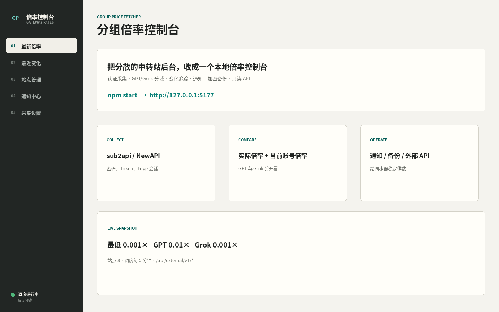
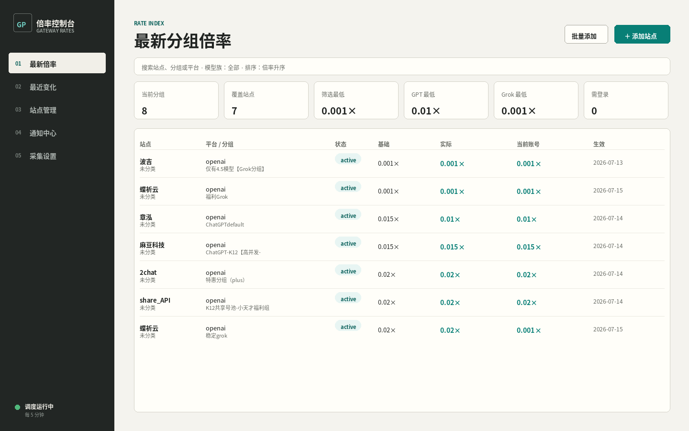
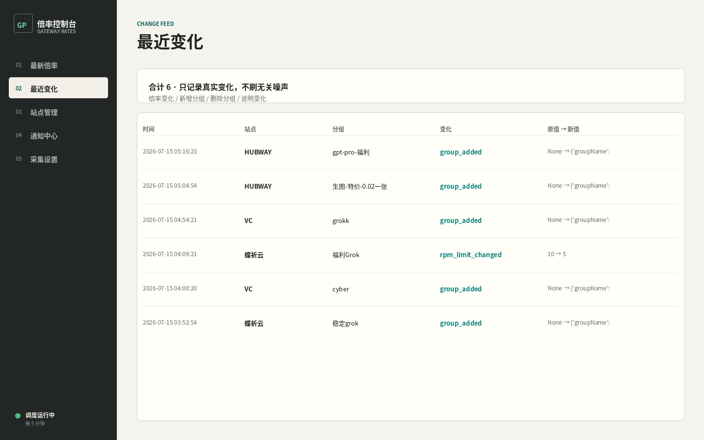
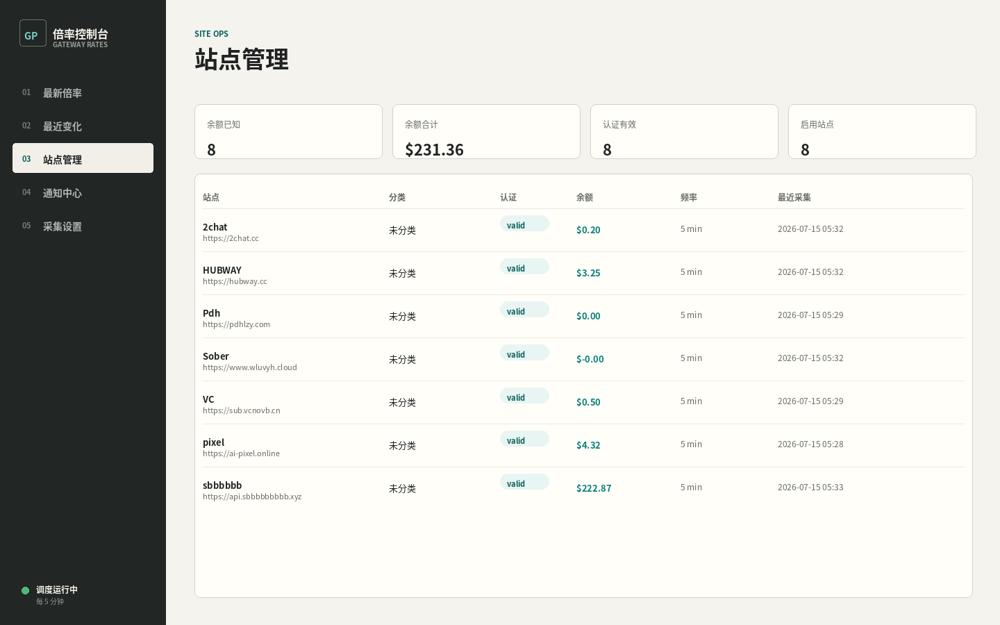
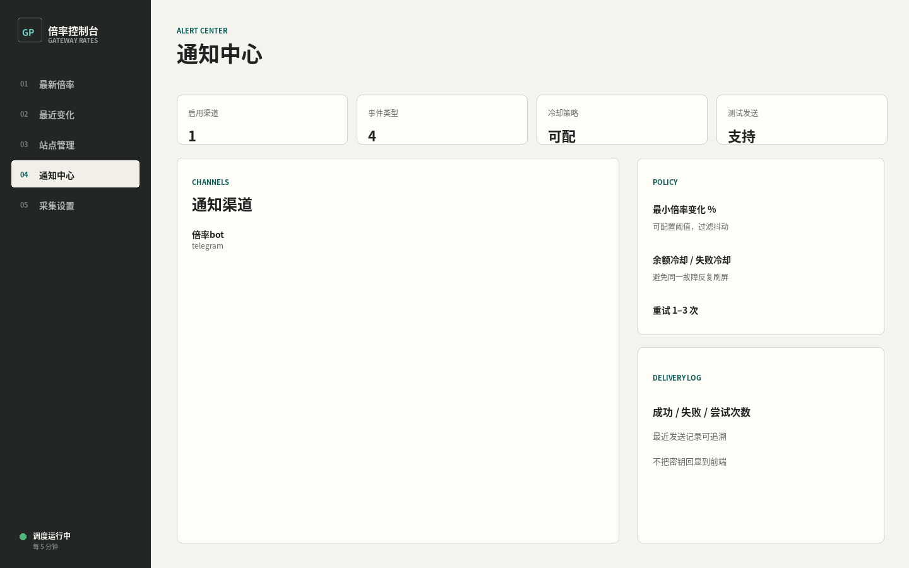
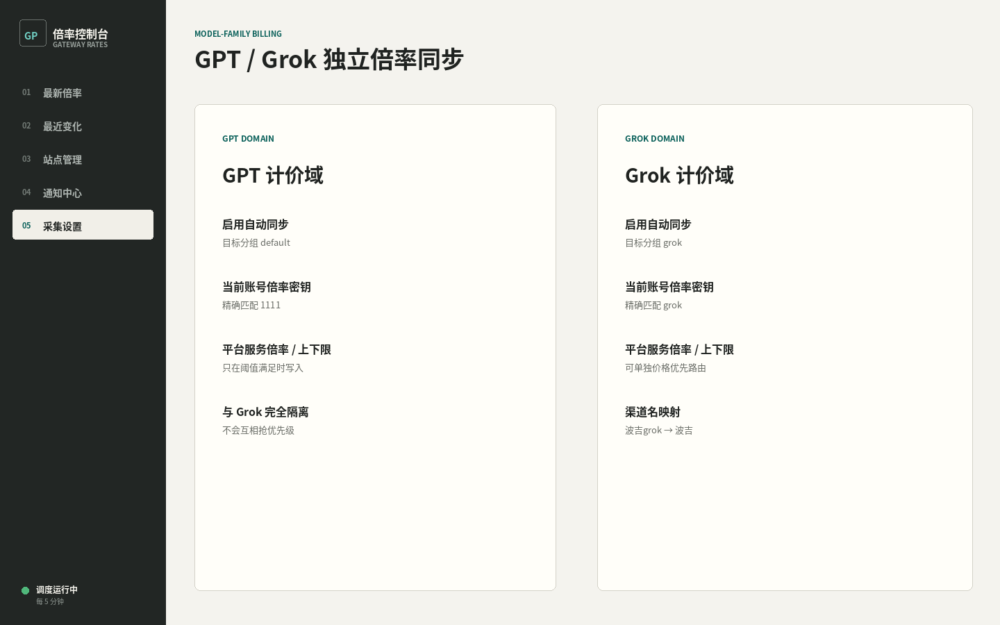

# 分组倍率控制台

[](LICENSE)
[](https://github.com/learning-kai/group-price-fetcher)
[](https://nodejs.org/)
[](#快速开始)
[](https://github.com/learning-kai/group-price-fetcher/releases)

[English](README.md) | [简体中文](README.zh-CN.md)

把分散在各中转站后台的分组价格收成一个本地控制台：采集认证后的真实倍率、分别比较 GPT/Grok 定价域、加密保存凭据，并为其他本地工具提供稳定只读 API。

```bash
npm install
npm start
# 打开 http://127.0.0.1:5177
```



## 为什么做

中转站价格通常藏在登录后台里，接口格式不统一，还夹杂账号专属倍率。如果每次都要打开多个管理页、手抄 Token、再把秘密写进笔记或仓库，对比成本会高到没法日常运维。

这个项目把“采集、排序、历史、认证状态、通知、备份、对外只读接口”收进一个本机服务，同时避免把凭据明文落在项目目录。

## 功能导览

### 1. 最新倍率：搜索、筛选、排序



- 同时展示 **基础倍率、实际倍率、当前账号倍率**
- 支持搜索站点/分组，按分类、标签、平台、**模型族（GPT/Grok/其他）**、分组状态、认证状态筛选
- 可按倍率、站点、分组、平台、更新时间排序
- 顶部指标：当前分组数、覆盖站点数、筛选最低、GPT 最低、Grok 最低、需登录数
- 支持本地隐藏噪声分组，不重写历史
- 支持每站点换算系数，方便跨站对齐比较

### 2. 最近变化：只记真实 diff



- 明确记录：倍率变化、分组新增/删除、说明变化等
- 保留旧值 → 新值与严重级别，方便审计
- 可按站点收窄，排查某个上游
- 设计目标是“有变化才记”，不是整表刷新噪音

### 3. 站点管理：认证、余额、调度



- Provider：`sub2api` 与 `NewAPI` 风格网关
- 认证：密码、可移植 Token、公开采集、Token 增强、Windows Edge Profile 兜底
- 展示余额、低余额阈值、最近采集时间
- 支持全局调度 + 单站覆盖
- 支持批量添加站点

### 4. 通知中心



- 渠道：Telegram、Webhook、邮件、企业微信、钉钉、飞书
- 可按 **站点** 与 **事件类型** 订阅
- 事件：倍率变化、低余额、认证失败、采集失败
- 策略：最小倍率变化百分比、余额冷却、失败冷却、重试次数
- 支持测试发送与发送日志
- 采集完成后异步派发，不阻塞抓取
- 密钥加密保存，前端不回显明文

### 5. GPT / Grok 独立计价域



- GPT 与 Grok 是两套定价域，不做整站混算
- GPT 当前账号倍率按活跃密钥名精确匹配 `1111`
- Grok 当前账号倍率按活跃密钥名精确匹配 `grok`
- 各自独立开关、目标分组、平台服务倍率、上下限、变化阈值
- 渠道名如 `波吉grok` 可映射回站点 `波吉`，供优先级同步器消费

### 6. 外部 API、导出与灾备

给本机/局域网工具用的只读接口：

```bash
curl -sS http://127.0.0.1:5177/api/external/v1/sites
curl -sS http://127.0.0.1:5177/api/external/v1/rates
curl -sS http://127.0.0.1:5177/api/external/v1/changes
```

| 路径 | 内容 | 适用场景 |
|---|---|---|
| JSON / CSV 导出 | 公开站点数据、倍率、变更 | 分享倍率，不含秘密 |
| `.gpfbackup` | SQLite 检查点 + 加密凭据 | 完整灾备 |
| `.gpftransfer` | 可移植站点配置与凭据 | 实例间迁移 |

备份使用 scrypt + AES-256-GCM，不包含 Edge Profile/Cookie。恢复时若 5177 仍被占用会拒绝执行；替换失败会成对回滚数据库与 vault。

## 截图总览

| 页面 | 预览 |
|---|---|
| 总览 |  |
| 最新倍率 |  |
| 最近变化 |  |
| 站点管理 |  |
| 通知中心 |  |
| GPT/Grok 策略 |  |

配图基于本机真实控制台布局与运行数据生成，方便对照实际功能，而不是空泛的宣传插画。

## 快速开始

### 环境要求

- Windows 10/11，或当前仍受支持的 Linux 发行版
- Node.js **22.5+**
- 仅在使用 Windows Edge Profile 提取时需要 Microsoft Edge

### Windows

```powershell
npm install
npm start
```

打开 [http://127.0.0.1:5177](http://127.0.0.1:5177)，添加站点，选择 Provider 与认证方式，然后执行第一次手动刷新。

```powershell
npm run startup:install
# 卸载：
npm run startup:uninstall
```

### Linux

把数据目录和 Vault 密钥放在仓库外：

```bash
export GROUP_PRICE_FETCHER_HOME=/var/lib/group-price-fetcher
export GROUP_PRICE_FETCHER_VAULT_KEY="$(openssl rand -hex 32)"
npm install
npm start
```

重启后必须使用同一把 Vault 密钥；丢失后旧凭据 vault 将无法解密。

Linux 支持公开采集、NewAPI Token、sub2api 密码和可移植 sub2api Token。Edge Profile 提取仍是 Windows 专属能力。公网部署时请让 Node 继续监听回环，并在反向代理上做 HTTPS 与鉴权。

### 可移植 sub2api Token 流程

1. 在 Windows 上用站点专用 Edge Profile 登录
2. 编辑站点 → **提取 Edge 会话**
3. 将 Access Token / 可选 Refresh Token 保存进加密 vault，模式为 `sub2api-token`
4. 在 Linux 上直接粘贴，或导入 Windows 导出的加密 `.gpftransfer`

采集器会复用有效 Access Token，并在可刷新时自动轮换；刷新失败时站点进入 `login_required`。普通状态/导出接口不会返回原始 Token。

## 外部 API

本机回环请求默认不需要 API Key：

```bash
curl -sS http://127.0.0.1:5177/api/external/v1/sites
curl -sS http://127.0.0.1:5177/api/external/v1/rates
curl -sS http://127.0.0.1:5177/api/external/v1/changes
```

```text
GET /api/external/v1/sites
GET /api/external/v1/rates
GET /api/external/v1/changes
GET /api/external/v1/sites/:id/rates
GET /api/external/v1/sites/:id/changes
GET /api/external/v1/sites/:id/groups/:groupId/history
```

局域网访问时，在设置中生成 API Key，以 `HOST=0.0.0.0` 启动，并发送 `Authorization: Bearer <api-key>`。管理端与凭据相关接口仍限制在本机回环。

## 工程质量

```bash
npm test
npm run test:acceptance
```

测试使用 Node 内置 test runner 和临时 SQLite。覆盖多站并发、部分失败、认证刷新、Provider 归一化、变更历史、API 鉴权、凭据脱敏、跨平台迁移、Linux vault 加密、重启恢复，以及通知中心路径。最近完整运行结果为 **162** 项通过。

## 项目文档

| 路径 | 用途 |
|---|---|
| `docs/assets/` | README 使用的功能截图 |
| `docs/site-transfer-format.md` | 可移植迁移包格式 |
| `docs/superpowers/` | 设计说明与实现计划 |
| `src/providers/` | sub2api / NewAPI 采集器 |
| `src/notificationService.js` | 通知渠道与派发 |
| `public/` | 控制台前端 |

## 隐私与安全边界

- 凭据静态加密；仓库中不应出现 vault key、`.env` 或线上数据库
- SQLite 保存运行元数据和倍率历史，不保存明文密码
- 外部 API 对站点/倍率/变更只读
- 管理与凭据接口默认仅本机可访问
- 公网部署必须在反向代理上做 HTTPS 与鉴权
- 含凭据的备份受密码保护；密码丢失不可找回

## 发布与更新

- 当前版本：**0.1.0**
- 源码仓库：[learning-kai/group-price-fetcher](https://github.com/learning-kai/group-price-fetcher)

```bash
git pull
npm install
npm test
npm start
```

升级时保持同一 `GROUP_PRICE_FETCHER_HOME` 与 vault key。

## 路线图

- 更丰富的通知模板与投递分析
- 更清晰的多模型族定价视图
- 更完整的反向代理部署示例
- 可选的签名发布与打包流程

## 贡献

1. Fork 后创建功能分支
2. 不要提交凭据和本地 `data/`
3. 提 PR 前运行 `npm test`
4. 优先提交可审查的小改动，并附真实命令与测试夹具

## 许可证

[MIT](LICENSE) © 2026 learning-kai
